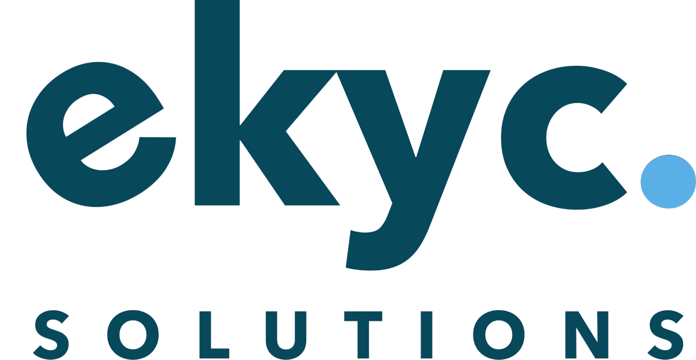

<!-- PROJECT LOGO -->
 

  <!--  -->

  <h1 align="center">Khmer OCR Benchmark Dataset</h1>

  

    This open-source project aims to provide a standardized benchmark dataset for Khmer Optical Character Recognition (OCR) engine. It consists of different difficulty levels where achieving good results on each level provides insights into specific capabilities of the OCR engine.
  

<!-- TABLE OF CONTENTS -->

<!-- Background -->

# Background

In Cambodia, an area of active development in AI technology is the Khmer OCR. However, it is currently difficult to determine the capabilities of Khmer OCR engines in the market. This is due to two reasons. First, those engines tend to benchmark performance on internal testing datasets, which often leads to bias in favor of the creator. Second, some engines ran performance tests on computer-generated opensource datasets provided by the Tessaract project, which does not reflect performance on real-world images. Hence, this project aims to solve this problem by providing a standardized benchmarking dataset for text recognition in the Khmer language.

<!-- Dataset Description -->

# Dataset Description

Each level aims to test the specific capabilities of the OCR engine. The levels are arranged in increasing difficulties and consist of subtasks. Each task consists of images and corresponding labels in JSON format. The labels are created using [LabelMe](https://github.com/wkentaro/labelme), an open-source Image Polygonal Annotation Tool.

## Level 1: Clean Digital Images

This level provides testing samples for clean digital images in the form of 15 Government Official Documents. There are four tasks at this level that provides variations of the same 15 documents. The table below outlines the description of each task.

<table>
  <tr>
   <td>Task 1
   </td>
   <td>Clean printed text exported from PDFs.
   </td>
  </tr>
  <tr>
   <td>Task 2
   </td>
   <td>Clean printed text sent through compression algorithms (Facebook Messenger)
   </td>
  </tr>
  <tr>
   <td>Task 3
   </td>
   <td>Printed text that is printed out and scanned back into digital format through a physical scanner.
   </td>
  </tr>
  <tr>
   <td>Task 4
   </td>
   <td>Printed text that is printed out and scanned back into digital format through scanner apps.
   </td>
  </tr>
</table>

<table>
  <tr>
   <td>image
   </td>
   <td>image with text box
   </td>
   <td>screenshot of labels
   </td>
  </tr>
</table>

### Text Images in this level include

1. Khmer printed text in straight lines.
2. Khmer printed text in bold letters.
3. Khmer printed text with a clean background.

### What can this data tell about your OCR?

OCR engine that performs well on this level can read Khmer text from Government Official Posts.

## Level 2: Scene Text Images

This level provides testing samples for scene text images which are text in real-world scenery. The images are taken through mobile devices. There are two tasks at this level:

<table>
  <tr>
   <td>Task 1
   </td>
   <td>Printed text images in sceneries with well lid condition.
   </td>
  </tr>
  <tr>
   <td>Task 2
   </td>
   <td>Printed text images in sceneries with low light conditions.
   </td>
  </tr>
</table>

<table>
  <tr>
   <td>image
   </td>
   <td>image with text box
   </td>
   <td>screenshot of labels
   </td>
  </tr>
</table>

### Text Images in this level include

1. Khmer printed text that is curved.
2. Khmer printed text with occlusions/noise.
3. Khmer printed text under different lighting conditions.
4. Khmer printed text with reflection.

### What can this data tell about your OCR?

OCR engine that performs well on this level can read Khmer printed text in the real world where the environment can’t be controlled.

## Level 3: Hand-Written Images

This level includes testing samples for handwritten text images. There are two tasks at this level:

<table>
  <tr>
   <td>Task 1
   </td>
   <td>Hand-written text images that are scanned with physical scanner.
   </td>
  </tr>
  <tr>
   <td>Task 2
   </td>
   <td>Hand-written text images that are scanned through scanner apps.
   </td>
  </tr>
</table>

<table>
  <tr>
   <td>image
   </td>
   <td>image with text box
   </td>
   <td>screenshot of labels
   </td>
  </tr>
</table>

This is the biggest level of OCR engine that was able to reconginize and understand the human written text that was present along side many of the real world document and text. This require the OCR engine to be capable of handling:

- The inconsistency of human written size, stroke, style, aligment and padding
- Accountable for human error in writing
- The randomness of text location

### What can this data tell about your OCR?

OCR engine that performs well on this level can read Khmer hand-written text in the real world where the environment can’t be controlled.

(<a href="#top">back to top</a>)

<!-- How to Evaluate with the Benchmark Dataset -->
# How to Evaluate with the Benchmark Dataset

1. Download the dataset at [[link]].
2. Test the dataset with your own OCR engine and provide the output in one text file in the following format.
3. Download the project and run `scripts/evaluate.sh [[your generate output location]]`

<!-- Road Map -->
# Road Map

- [x] Level 1: Clean Digital Images
- [] Level 2: Scene Text Images
- [] Level 3: Hand Written Images

<!-- CONTRIBUTORS

## Contributors

 -->

<!-- ACKNOWLEDGMENTS -->

# Acknowledgments

This open project is initiated in collaboration with institutions from different industries in Cambodia. We are grateful for their continuing support of this project and our mission to help improve the state of the Khmer OCR engine.

<table>
  <tr>
   <td>

   </td>
   <td>

   </td>
   <td>

   </td>
  </tr>
  <tr>
   <td>
   <a href="https://ekycsolutions.com" target="_blank">EKYC Solutions</a>
   </td>
   <td>
     <a href="https://www.prudential.com.kh/" target="_blank">Prudential Life Assurance PLC</a>
   </td>
   <td>
     <a href="https://paragoniu.edu.kh/" target="_blank">Paragon International University</a></td>
   </td>
  </tr>
</table>

<!-- LICENSE -->

## License

Distributed under the MIT License. See `LICENSE.txt` for more information.

<!-- CONTACT -->

## Contact

Email: [contact@ekycsolutions.com](contact@ekycsolutions.com)

(<a href="#top">back to top</a>)

